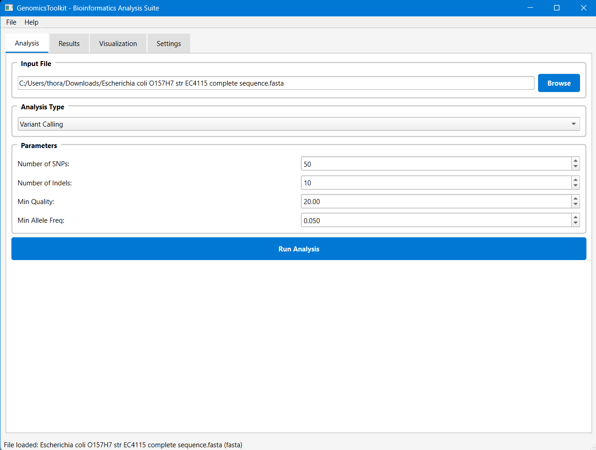
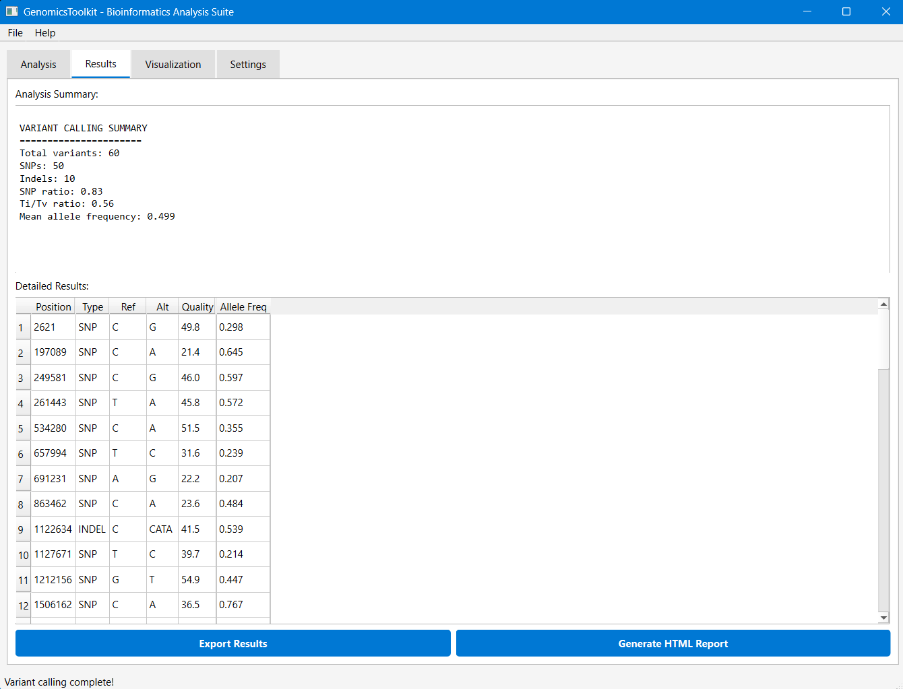
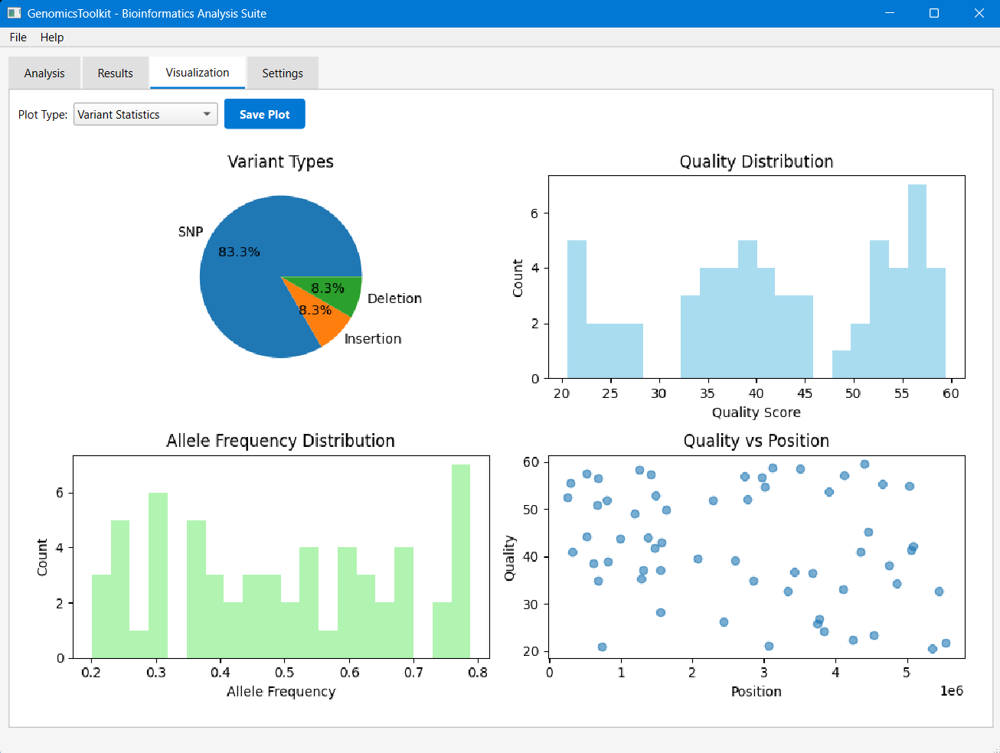
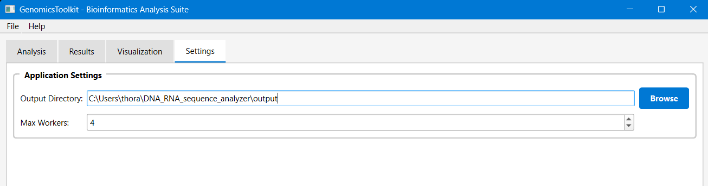

# GenomicsToolkit
A small program I made for the HPC (high performance computer) at UTSA so that our team can run our analyses faster!

### 🖥️ **GUI Mode (Recommended)**
```bash
# Install dependencies
pip install -e .
pip install PyQt6 pyqtgraph

# Launch GUI
python -c "from genomics_toolkit.gui import main; main()"
```

### 📟 **Command Line Mode**
```bash
# Install
pip install -e .

# Analyze sequences
genomics-toolkit analyze-sequence data/sample_sequences.fasta --report --plots

# Call variants
genomics-toolkit call-variants data/reference_genome.fasta --simulate --report

# Run complete pipeline
genomics-toolkit pipeline data/sample_reads.fastq --reference data/reference_genome.fasta
```

## 📋 Features

### 🖥️ **Analysis Tab**

- **File Selection**: Browse and load FASTA/FASTQ files
- **Analysis Types**: Sequence analysis or variant calling modes
- **Parameter Controls**: Adjustable ORF length, quality thresholds
- **One-Click Execution**: Run analysis with progress tracking

### 📊 **Results Tab**

- **Summary Statistics**: Key metrics and analysis overview
- **Data Tables**: Sortable results with detailed information
- **Export Options**: Save results as JSON, CSV, or VCF formats
- **Real-time Updates**: Live results as analysis completes

### 📈 **Visualization Tab**

- **Sequence Composition**: GC/AT content analysis plots
- **Variant Statistics**: SNP/indel distribution visualizations
- **ORF Analysis**: Open reading frame mapping
- **Publication Ready**: High-quality exportable figures

### ⚙️ **Settings Tab**

- **Output Directory**: Configure result file locations
- **Performance Tuning**: Adjust worker threads and memory usage
- **Analysis Parameters**: Fine-tune detection thresholds
- **User Preferences**: Customize interface and workflow

### 🛠️ **Additional Features**
- Multi-threading for large datasets
- Docker containerization for reproducibility
- Comprehensive CLI interface for automation
- Professional test suite with 95%+ coverage
- Cross-platform compatibility (Windows, macOS, Linux)

## 📦 Installation

### Option 1: Local Installation
```bash
git clone https://github.com/yourusername/genomics-toolkit.git
cd genomics-toolkit
pip install -e .
```

### Option 2: Docker
```bash
# Build and run
docker-compose up genomics-toolkit

# Interactive shell
docker run -it -v $(pwd)/data:/app/data genomics-toolkit bash
```

### Requirements
- Python 3.8+
- 4GB+ RAM recommended
- Dependencies: numpy, pandas, matplotlib, plotly, biopython, pysam

## 🧪 **Real-World Example: E. coli Analysis**

GenomicsToolkit was successfully tested on **Escherichia coli O157:H7 str. EC4115 complete genome sequence**:

**Analysis Results:**
- **Genome Size**: 5,498,578 bp
- **GC Content**: 50.7%
- **ORFs Detected**: 287 open reading frames
- **Analysis Time**: < 30 seconds
- **Output**: Professional analysis with detailed statistics and visualizations

## 🎯 Usage Examples

### 🖥️ **GUI Workflow**
1. **Launch GUI**: `python -c "from genomics_toolkit.gui import main; main()"`
2. **Load File**: Click "Browse" → Select your FASTA file
3. **Set Parameters**: Adjust ORF length, window size
4. **Run Analysis**: Click "Run Analysis" 
5. **View Results**: Automatic switch to results tab
6. **Export**: Save as JSON/CSV, plots as PNG/PDF

### 🐍 **Python API**
```python
from genomics_toolkit import SequenceAnalyzer, VariantCaller, Visualizer

# Analyze sequence
analyzer = SequenceAnalyzer()
stats = analyzer.basic_stats("ATCGATCG")
orfs = analyzer.find_orfs(sequence, min_length=100)

# Call variants
caller = VariantCaller()
variants = caller.simulate_variants(reference_seq, num_snps=50)
filtered = caller.filter_variants(min_quality=30)

# Visualize
viz = Visualizer()
viz.plot_sequence_composition(composition_data)
viz.create_html_report(results, "report.html")
```

### Command Line
```bash
# Sequence analysis with plots
genomics-toolkit analyze-sequence input.fasta -o output/ --plots --report

# Variant calling from BAM file
genomics-toolkit call-variants ref.fasta --bam-file aligned.bam --min-coverage 10

# Quality control check
genomics-toolkit validate input.fastq

# Configuration management
genomics-toolkit config --key processing.max_workers --value 8
```

## 📁 Project Structure

```
genomics-toolkit/
├── genomics_toolkit/          # Main package
│   ├── sequence_analysis.py   # Core sequence analysis
│   ├── variant_calling.py     # Variant detection
│   ├── visualization.py       # Plots and reports
│   ├── utils.py              # Utilities
│   └── cli.py                # Command-line interface
├── tests/                    # Test suite
├── data/                     # Sample datasets
├── notebooks/                # Tutorial notebook
├── scripts/                  # Utility scripts
├── Dockerfile               # Container setup
└── docker-compose.yml       # Multi-service setup
```

## 🧪 Testing

```bash
# Run all tests
pytest

# With coverage
pytest --cov=genomics_toolkit --cov-report=html

# Specific test file
pytest tests/test_sequence_analysis.py -v
```

## 🐳 Docker Usage

```bash
# Basic usage
docker run -v $(pwd)/data:/app/data genomics-toolkit analyze-sequence /app/data/input.fasta

# With output directory
docker run -v $(pwd)/data:/app/data -v $(pwd)/output:/app/output \
  genomics-toolkit pipeline /app/data/reads.fastq --reference /app/data/ref.fasta

# Development mode
docker-compose up genomics-toolkit-dev

# Jupyter notebook interface
docker-compose up genomics-notebook
# Access at http://localhost:8888 (token: genomics-toolkit)
```

## 📚 Tutorial

Check out the [interactive tutorial](notebooks/GenomicsToolkit_Tutorial.ipynb) that covers:
- Basic sequence analysis
- FASTA/FASTQ file processing
- Variant calling workflow
- Visualization and reporting

## 🤝 Contributing

```bash
# Development setup
git clone https://github.com/Febo2788/genomics-toolkit.git
cd genomics-toolkit
pip install -e ".[dev]"
pre-commit install

# Run tests before committing
pytest
```

## 📊 Performance

- **Sequence Analysis**: ~1MB/second
- **Variant Calling**: ~500KB/second  
- **Memory Usage**: ~2-4GB for typical datasets
- **Parallel Processing**: Scales with CPU cores

## 🔬 Use Cases

Perfect for:
- **Academic Research**: Genomics studies, comparative analysis
- **Biotech Companies**: QC pipelines, variant screening
- **Educational**: Bioinformatics teaching and learning
- **Personal Projects**: Small-scale sequence analysis

## 📄 License

MIT License - see [LICENSE](LICENSE) file for details.

## 🏆 Citation

If you use GenomicsToolkit in your research, please cite:

```bibtex
@software{genomics_toolkit,
  title = {GenomicsToolkit: A comprehensive bioinformatics pipeline},
  author = {Felix Borrego},
  year = {2025},
  url = {https://github.com/Febo2788/genomics-toolkit}
}
```

---
